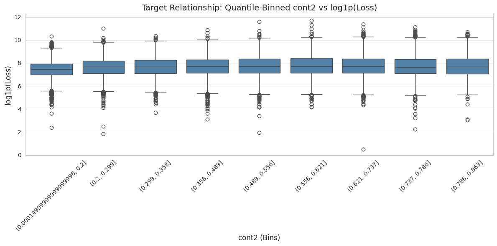

# AI Studio Challenge Project Title

---

### **Team Members**

| Name             | GitHub Handle | Contribution          |
| ---------------- | ------------- | --------------------- |
| Nevaeh Dickerson | @vaeh4codes   | Data Exploration      |
| Matthew Tan      | @mtan121      |                       |
| Andre Miller     |     @andredmiller12          |         Gate 3              |

---

## **- Project Highlights -**

---

## **- Setup and Installation -**

---

## **- Project Overview -**

This project is part of the **Break Through Tech AI/ML Fellowship with Cornell Tech** for the 2026–2027 cohort. The year-long fellowship consists of four main sections:

- **Spring:** Python Bootcamp
- **Summer:** Machine Learning Certificate Bootcamp
- **Fall:** AI Studio
- **Spring:** AI Specializations

This project takes place during the **Fall AI Studio**, where fellows are placed into teams and partnered with industry host companies to apply their machine learning skills to real-world business problems.

Our team is partnered with **Allstate** to explore how machine learning can improve the estimation of final auto insurance claim costs. Because the final cost of a claim may not be known for months due to factors such as repair timelines and legal determinations, our objective is to develop a machine learning model that can predict the final claim cost using information available when the claim is initially filed.

From a real-world perspective, more accurate early claim estimates could help insurance professionals make better-informed decisions when setting reserves and better understand the factors that contribute to higher claim costs. Ultimately, this work explores how machine learning can support a more efficient and data-driven claims estimation process.

---

## - **Data Exploration -**

---

## 📊 Data Exploration

### Dataset Overview

Our project uses a historical **Allstate auto insurance claims dataset** provided for the Break Through Tech AI Studio project. The dataset is stored as a CSV file and contains **188,318 claim records and 132 columns**.

Each row represents an individual insurance claim. The dataset contains:

- **1 identifier:** `id`
- **116 categorical features:** `cat1` through `cat116`
- **14 continuous features:** `cont1` through `cont14`
- **1 target variable:** `loss`, representing claim severity/cost

All predictor variables are anonymized, meaning their real-world business meanings are not provided.

### Data Readiness and Validation

Before beginning exploratory analysis, we verified the dataset's structure and integrity. Our checks confirmed that:

- The dataset contains the expected **188,318 rows and 132 columns**
- `id` contains no missing values
- No duplicate rows were identified
- All 14 continuous features are numeric and fall within the expected **0 to 1 range**
- All 116 categorical features are stored as categorical/object data
- The `loss` target is numeric, finite, and positive
- No missing values were identified in the dataset

Based on these checks, the dataset was considered structurally ready for exploratory data analysis.

### Exploratory Data Analysis

Our EDA focuses on understanding the target distribution and identifying relationships between the anonymized predictors and claim loss.

**Target Analysis**

We examined descriptive statistics and the distribution of `loss`. Claim losses range from **$0.67 to $121,012.25**, with a median of **$2,115.57** and mean of approximately **$3,037.34**.

The target distribution is strongly **right-skewed**, with a smaller number of claims having substantially larger losses. Because of this skew, we use `log1p(loss)` for selected visualizations to make patterns across the majority of claims easier to observe.

A median-based baseline produces a **Mean Absolute Error (MAE) of approximately $1,809.05**, providing an initial benchmark for future models.

**Categorical Features**

Categorical variables are analyzed using:

- Category frequency distributions
- Rare-level identification
- Count plots
- Relationships between categories and `log1p(loss)`
- Box plots for comparing target distributions across categories

For visualization and analysis, categorical levels representing **less than 1% of observations** may be grouped into an `Other` category to prevent very small groups from dominating or cluttering comparisons.

**Continuous Features**

Continuous variables are explored using:

- Descriptive statistics
- Feature-to-feature and feature-to-target correlations
- Distribution analysis
- Quantile-based binning
- Comparisons between feature bins and `log1p(loss)`

Quantile binning allows us to examine whether claim severity changes across different ranges of a continuous feature without assuming that the relationship is strictly linear.

### Key Findings So Far

- The dataset passed the initial structural and integrity checks required for downstream EDA.
- `loss` is substantially right-skewed, motivating the use of a log transformation for visualization.
- The anonymized features require relationships to be evaluated statistically rather than interpreted through known business meanings.
- Rare categorical levels require careful handling when comparing categories.
- Continuous predictors are being evaluated using both correlation and binned target relationships rather than relying on correlation alone.

### Challenges and Limitations

The primary limitation of the dataset is **feature anonymization**. Variables such as `cat1` and `cont1` do not have documented real-world meanings, limiting our ability to explain *why* a particular feature may be associated with claim severity.

For this reason, our EDA focuses on identifying reproducible statistical patterns while avoiding unsupported assumptions about what the anonymized variables represent.

### EDA Visualizations

Our analysis includes visualizations such as:

- Raw `loss` distribution vs. `log1p(loss)` distribution
- Categorical feature frequency plots
- Categorical feature vs. `log1p(loss)` box plots
- Continuous-feature correlation analysis
- Quantile-binned continuous feature vs. `log1p(loss)` box plots

These visualizations are used to document important patterns and guide feature and modeling decisions in later project stages.

## **- Model Development -**

---

## - **Results & Key Findings -**

---

## - **Next Steps -**

---

## - **License -**

---

## **- References** -

---

## - **Acknowledgements** -

